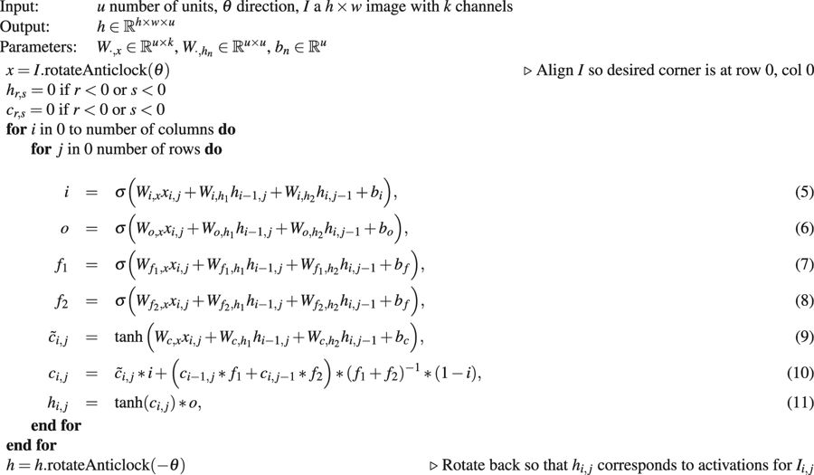

# Multidimensional LSTM (2D)
This is an implementation of the MDLSTM layer used for [Adaptive Optics Image Segmentation](https://www.nature.com/articles/s41598-018-26350-3). And is obviously based on the original [paper](https://arxiv.org/abs/0705.2011) with some modification described below.
 
MDRNN             |  MDLSTM
:-------------------------:|:-------------------------:
  |  

## To use
```python
from layers.two_d_LSTM import MD_parallel

# input_tensor: tensor of shape [batch, height, width, channels]
# units : int > 0
# cell_computation \in ['graves', 'leaky']
# initialisation_sigma: stddev for gaussian initialisation
out = MD_parallel(
    input_tensor, 
    units, 
    cell_computation, 
    initialisation_sigma)
    
# out is shape [batch, height, width, units, 4]
# with 4 being the number of MDLSTM blocks which were run
# from each corner. The subtensor out[0, 0, 0] contains
# the activations at pixel 0, 0 for each of these blocks
# for the top left block this is the first computed activation
# for the bottom right block this is the final activation
```

The above is all you need if you just want to use the layer, to use the tools used here to train etc see the example in networks for how to construct input_pipelines, and networks. And main for how to train them.
## Faster MDLSTM
To speed up training and inference, the MDLSTM layer is implemented as described [here](https://ieeexplore.ieee.org/document/7814068), which simply says that we can go diagonal by diagonal rather than pixel by pixel, to take greater advantage of parallelism.

## Cells 
There are currently a choice of two cell state calculations. One from the original paper and a [leaky](https://dl.acm.org/citation.cfm?id=2946645.3007050) cell:
<p align="center"></p>
and one which attempts to be more stable:
<p align="center"></p>
The later tries to keep the resulting cell state bounded as <p align="center"></p>

## Examples

### Locate cone photoreceptors

### Toy dataset

### Of note
- Gradients are clipped by norm, within the recurrent steps
- Layer runs 4 MDLSTM blocks in 4 directions as in original paper
